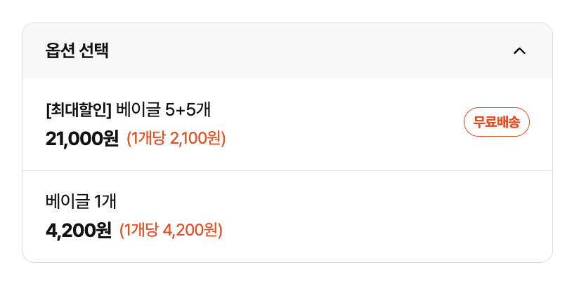
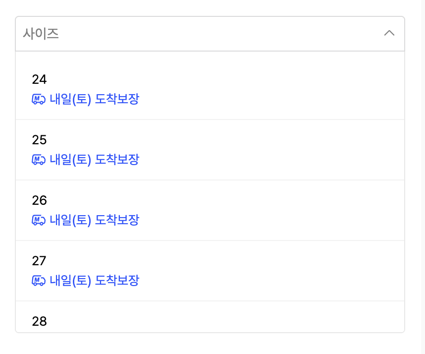
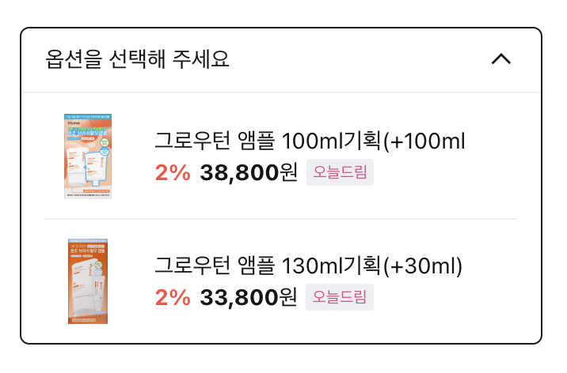

# 4주차 — 프레임워크 착수 & 디자인 패턴: Select(Headless) · Dialog(Compound)

## 이번 주 범위

- **Next.js 세팅** — 커머스 프로젝트를 `create-next-app`(App Router)으로 새로 세운다
- **하네스 이식** — 1주차에 세운 ESLint/husky를 Next로 가져와 다시 세운다
- **Select (Headless)** — 로직 한 벌, 생김새는 사용처가. 같은 로직이 여러 생김새를 커버한다
- **Dialog (Compound)** — Context로 조립 + controlled/uncontrolled 이중 API

---

## 📝 Implementation Quest

### 🧱 0단계 — Next 세팅 + 하네스 이식

- `create-next-app`(TypeScript + App Router)으로 커머스 베이스를 새로 만든다. (기존 Vite 프로젝트를 옮기는 게 아니라, 프로젝트는 새로 시작하고 하네스만 1주차에서 가져온다.)
- `create-next-app`이 깔아주는 기본 ESLint를 그대로 두지 않는다. 내 flat config로 갈아끼우고, Next 전용 룰(`@next/eslint-plugin-next`)은 왜 넣는지 설명할 수 있어야 한다.
- husky 게이트가 Next에서도 막히는지 재검증한다.

### 1단계 — Select (Headless)

"생김새"가 아니라 "동작" 을 만든다. 로직(열기/닫기·선택값·키보드·품절 스킵)은 한 벌, 생김새만 사용처가 갈아끼운다.

**요구사항**

- 라이브러리를 쓰지 않고 패턴 자체를 직접 구현한다.
- 네이티브 `<select>`를 감싸는 건 인정하지 않는다. 브라우저가 키보드를 대신 해주면 직접 설계한 게 없다. `
`/`<ul>` 마크업으로 만든다.
- `value`는 문자열이 아니라 옵션 객체 전체를 다룬다. `onChange`가 가격·배송 계산에 쓸 객체를 돌려줘야 한다.
- 옵션 생김새는 사용처가 자유롭게 그리고, 로직은 상태만 노출해 스타일 판단을 사용처에 맡긴다.
- 품절 옵션은 키보드 이동에서 건너뛰고 선택할 수 없다.
- 사용처가 각 옵션의 `selected` / `highlighted` / `disabled`를 알 수 있어야 한다.

> 💡 **직접 설계할 것 = 패턴 / 도구를 쓸 것 = 인프라.**
> 위치 계산은 이번 배움과 무관한 시간 낭비다. 인라인 펼침이면 CSS로 충분하고, 팝오버가 필요하면 `@floating-ui/react`를 쓴다. popper를 직접 짜지 않는다.

**레퍼런스** — Downshift `useSelect` · Headless UI `Listbox` — API 모양만 참고.

**완료조건** — 아래 3가지 select box를 렌더할 수 있어야 한다.

### 2단계 — Dialog (Compound)

이름은 `Dialog` 로 쓴다. *(참고: `Dialog`는 컴포넌트, 'modal'은 배경을 막는 동작을 뜻하는 형용사다.)*

**요구사항**

- compound 조립: `Dialog / Dialog.Trigger / Dialog.Overlay / Dialog.Content / Dialog.Title / Dialog.Description / Dialog.Close`
- controlled(`open`·`onOpenChange`)와 uncontrolled 둘 다 지원한다. ← 이번 주의 알맹이. `open` prop 유무로 판별하는 이중 API를 직접 구현한다.
- `Dialog.Content`/`Overlay`는 Portal로 렌더한다.
- Esc / 오버레이 클릭으로 닫히고, 열려 있는 동안 배경 스크롤을 잠근다.

> 💡 **이번 주 범위 밖 — 포커스 관리는 하지 않는다.** 포커스 트랩·복원·초기 포커스는 DOM 엣지케이스 싸움이라 이번 배움(Compound 설계)과 결이 다르다. 여기 시간 쓰지 말고 compound 조립 + 이중 API에 집중한다. ARIA 속성도 이번엔 다루지 않는다.

**레퍼런스** — Radix / Headless UI `Dialog` — API 모양(조각 구성·이중 API) 만 참고.

---

## ✅ Checklist

**Next / 하네스**

- [ ] `create-next-app` 기본 ESLint를 그대로 두지 않고 내 config로 갈아끼웠는가
- [ ] Next 전용 룰을 근거와 함께 편입했는가
- [ ] husky 게이트가 Next에서도 막히는지 재검증했는가

**Select (Headless)**

- [ ] 라이브러리 없이 직접 구현했는가 (네이티브 `<select>` 감싸기 ✗)
- [ ] 로직을 노출하는 인터페이스를 스스로 설계하고, 그 근거를 설명할 수 있는가
- [ ] 같은 로직으로 서로 다른 옵션 UI 3종을 렌더했는가
- [ ] `value`가 옵션 객체 전체인가 (가격·배송 계산에 쓰이는가)
- [ ] 키보드로 열기·이동(↑↓)·선택(Enter)·닫기(Esc)가 되는가
- [ ] 품절 옵션을 키보드 이동에서 건너뛰는가

**Dialog (Compound)**

- [ ] compound로 조립했는가 (`Trigger`/`Overlay`/`Content`/`Title`/`Description`/`Close`)
- [ ] controlled / uncontrolled 둘 다 되는가 (`open` prop 유무로 판별하는 이중 API)
- [ ] `Content`를 Portal로 렌더했는가
- [ ] Esc / 오버레이 클릭으로 닫히고, 배경 스크롤이 잠기는가

**공통**

- [ ] 변경마다 "왜 이렇게 설계했는가" 한 줄 근거가 있는가
- [ ] AI로 생성한 부분을 표기하고 직접 검토했는가
