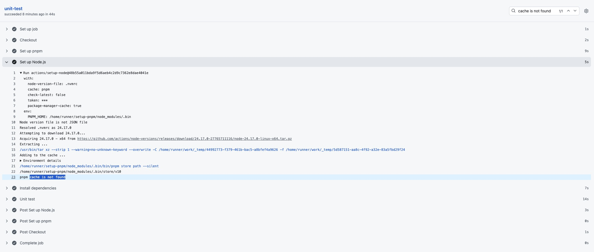
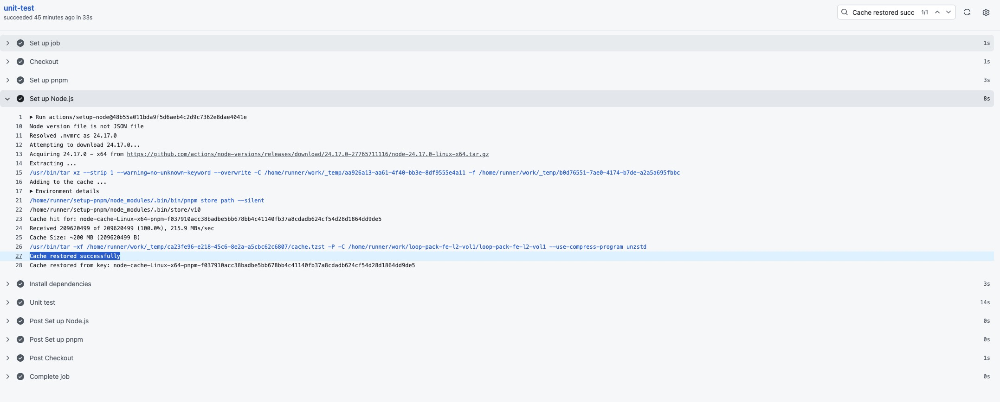
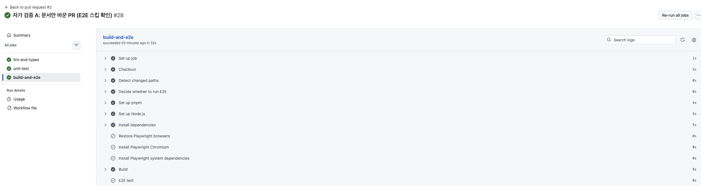
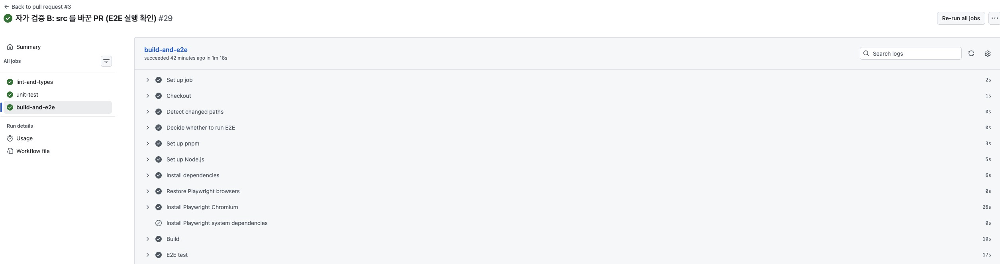
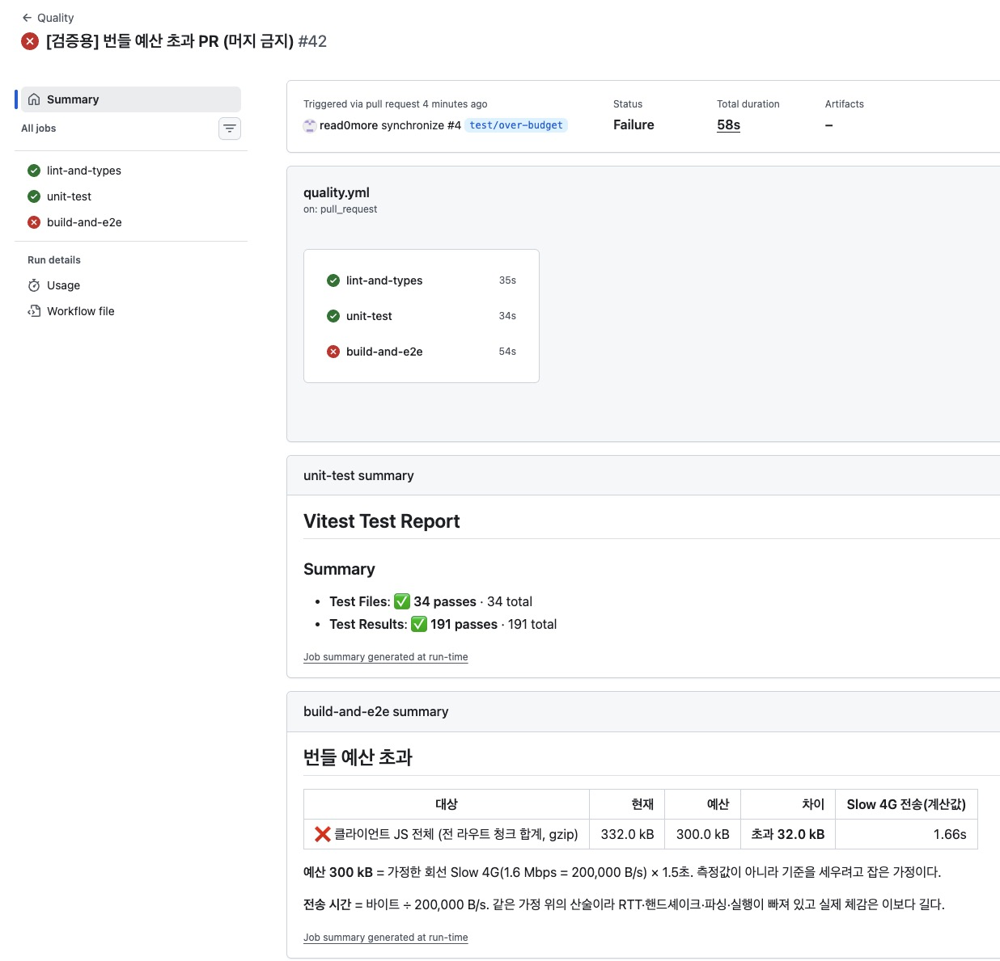

# 10주차 - CI 측정·설계 기록

과제 제출물 중 문서로 남겨야 하는 것을 단계별로 정리합니다.

## 최종 제출물

| 제출물 | 위치 |
| --- | --- |
| CI workflow (측정·최적화·조건부 실행·보안 반영) | `.github/workflows/quality.yml`, `.github/workflows/ai-review.yml` |
| CI Before/After 측정 기록 + 캐시 로그 | [1단계 - CI 측정·최적화](#1단계---ci-측정최적화) |
| 조건부 실행 설계 근거 + 걸리는/안 걸리는 PR 로그 | [2단계 - 조건부 실행](#2단계---조건부-실행) |
| 번들 예산 설정 + 근거 | [번들 예산 설정과 근거](#번들-예산-설정과-근거) |
| 환경 변수 검증 코드 | `scripts/validate-env.mjs` |
| 예산 초과 빨간불 + PR 에 노출된 실패 리포트 | [예산 초과 빨간불과 PR 에 노출된 실패 리포트](#예산-초과-빨간불과-pr-에-노출된-실패-리포트) |
| AI 리뷰 기준(프롬프트) + 잘 잡은 것 1 / 헛소리 1 / 프롬프트 개선 | [4단계 - AI 코드리뷰](#4단계---ai-코드리뷰) |
| 승격한 결정적 룰 + 자가 검증 기록 | [5단계 - AI 지적을 결정적 룰로 승격](#5단계---ai-지적을-결정적-룰로-승격) |
| 생각해 볼 질문 답변 (4개, 각 2~4문장) | [함께 생각해 볼 질문](#함께-생각해-볼-질문) |
| 10주 기술 회고 | `docs/rfc/week10-retrospective.md` |

---

# 1단계 - CI 측정·최적화

## Before / After 측정 기록

같은 커밋, 같은 러너, cold/warm 각 3회입니다. 검증 항목은 Before 와 After 가 같습니다. 뺀 검증은 없습니다.

| 조건 | | raw 3회 | 중앙값 | 범위 |
| --- | --- | --- | --- | --- |
| warm | Before | 112 / 126 / 111 | 112s | 111s ~ 126s |
| | **After** | 78 / 78 / 73 | **78s** | **73s ~ 78s** |
| cold | Before | 144 / 122 / 122 | 122s | 122s ~ 144s |
| | **After** | 79 / 80 / 85 | **80s** | **79s ~ 85s** |

## 병목 지목

| step | warm 중앙값 | cold 중앙값 | 캐시 효과 |
| --- | --- | --- | --- |
| Set up Node.js (복원) | 9s | 7s | **-2s** (캐시 쪽이 느림) |
| Install dependencies | 3s | 6s | +3s |
| Post Set up Node.js (저장) | 0s | 6s | +6s |
| | | | **순이득 약 7s** |

그런데 `Run quality checks` 단일 step 의 변동폭이 48s ~ 66s 로 **18초**입니다. **순이득 7초가 노이즈 18초에 묻힙니다.**

진짜 병목은 로그 타임스탬프에서 나왔습니다.

```
E2E 시작 직전 12.5초 공백
Playwright 리포터 보고 26.6s  vs  실측 구간 14.7s  → 차이 11.9s
```

`playwright.config.ts` 의 `webServer.command` 가 `pnpm build && pnpm start` 라 **빌드가 한 번 더 돌고 있었습니다.** `pnpm check` 끝의 `next build` 와 합쳐 **16.5초, warm 112초의 15%** 였습니다.

## 왜 이 전략만 골랐나

| 전략 | 이 레포는 | 적용 |
| --- | --- | --- |
| job 병렬화 | `pnpm check` 한 줄에 여섯 검증이 직렬 | ✅ 3 job 으로 분할 |
| `concurrency` 그룹 | 같은 PR 연속 push 가 잦음 | ✅ |
| pnpm store 캐시 | 이미 걸려 있고 hit 도 됨. 순이득 7초가 노이즈에 묻힘 | **추가 조치 없음** |
| 중복 build 제거 | 16.5초, 전체의 15% | ✅ CI 에서 `webServer.command` 를 `pnpm start` 로 |
| Playwright 브라우저 캐시 | 캐시 대상에서 누락, cold=warm 24s | ✅ 24s → 16s |

main push 는 취소하지 않습니다. 그 커밋이 검증됐다는 기록이 사라지기 때문입니다.

```yaml
concurrency:
  group: ${{ github.workflow }}-${{ github.ref }}
  cancel-in-progress: ${{ github.event_name == 'pull_request' }}
```

## 캐시 hit / miss 로그

warm 3회 모두 `Set up Node.js` 에서 `Cache restored from key: node-cache-Linux-x64-pnpm-f037910a...`, `Post Set up Node.js` 에서 `Cache hit occurred on the primary key ..., not saving cache.` 가 찍혔습니다. cold 3회 모두 `pnpm cache is not found` 와 `Cache saved with the key: ...` 였습니다.

| step (`unit-test` job) | hit | miss | |
| --- | --- | --- | --- |
| Set up Node.js | 8s | **5s** | miss 가 3초 **빠릅니다** |
| Install dependencies | 3s | **7s** | miss 가 4초 느립니다 |
| Post Set up Node.js | 0s | **3s** | miss 가 3초 느립니다 |

`Set up Node.js` 는 Node 설치만 하는 게 아니라 캐시 복원까지 합니다. hit 는 약 200MB 를 내려받아 푸는데(`Received 209620499 of 209620499`), miss 는 한 줄 찍고 끝납니다. **miss 가 빨라진 게 아니라 hit 가 복원 비용을 낸 것입니다.**

cold (`unit-test` job). `Set up Node.js` 가 5초에 끝나고 마지막 줄이 `pnpm cache is not found` 입니다. `Install dependencies` 7초, `Post Set up Node.js` 3초로 캐시를 새로 저장합니다.



warm (같은 job). 같은 step 이 8초로 늘었고 `Cache hit for: node-cache-Linux-x64-pnpm-f037910a...` 뒤에 `Received 209620499 of 209620499 (100.0%)`, `Cache restored successfully` 가 찍힙니다. `Install dependencies` 는 3초, `Post Set up Node.js` 는 0초입니다.



---

# 2단계 - 조건부 실행

## 조건부 실행 설계 근거

| 검증 | 성격 | 이 레포의 조건 |
| --- | --- | --- |
| lint · FSD 경계 · typecheck · unit test | 결정적·저비용 | 모든 PR. 조건 없음 |
| production build | 결정적 | 모든 PR. **조건 없음** |
| E2E | 비쌈 | `docs/**`·`**/*.md` 외 변경이 있을 때만 |

build 에 조건을 안 건 이유는 **"문서만 바뀌었다"가 필터의 판정이지 사실이 아니기 때문**입니다. 문서만 바꾼 PR 에서 빌드가 깨질 경로가 둘 있습니다.

- **문서가 코드에 읽히는 경우.** 필터는 경로와 무관하게 `**/*.md` 를 전부 제외하므로 `src/` 안의 `.md` 도 문서로 분류됩니다. 이 저장소에는 `docs/assets/week-05-product-images.md` 를 읽어 표 행을 파싱하는 테스트가 이미 있습니다(`src/app/api/_data/commerce.test.ts`). 그 파일을 고치거나 지우면 문서만 바꾼 PR 인데 검증이 깨집니다.
- **빌드가 diff 밖의 것도 보는 경우.** `pnpm build` 는 `prebuild` 로 환경 변수 검증을 먼저 돌립니다. 코드를 한 줄도 안 고쳐도 secrets 설정이 잘못되면 여기서 잡힙니다.

```yaml
filters: |
  code:
    - '**'
    - '!docs/**'
    - '!**/*.md'
```

**"E2E 를 돌 파일"을 적는 allowlist 를 일부러 쓰지 않았습니다.** 그러면 목록에 넣는 걸 깜빡한 파일만 고친 PR 이 E2E 없이 통과합니다. **실수가 통과를 만드는 방향**입니다. denylist 는 반대로 실수하면 불필요하게 돌 뿐입니다. 기본값 `some` 은 부정 패턴을 무시하므로 `predicate-quantifier: some-with-excludes` 를 명시했습니다.

## required 와 조건부 스킵의 충돌 회피

**조건을 job 이 아니라 step 에 걸었습니다.** job 을 통째로 스킵하면 GitHub 에 결과가 보고되지 않아 required check 가 "대기 중"으로 남고 PR 이 영영 못 머지됩니다. job 은 항상 돌고 안에서 E2E step 만 건너뜁니다.

```yaml
- name: E2E test
  if: steps.e2e.outputs.run == 'true'
  run: pnpm test:e2e
```

required status checks 는 `["lint-and-types", "unit-test", "build-and-e2e"]` 셋이고 전부 항상 결론을 보고합니다.

## 스킵이 안전한 이유

- `docs/**` 와 `**/*.md` 는 **빌드 산출물에 들어가지 않습니다.** 런타임 동작을 바꿀 경로가 없습니다
- 그럼에도 **build 는 그대로 돕니다.** 문서 PR 이 빌드를 깨는 경우는 여기서 잡힙니다
- main push 는 필터를 보지 않습니다. **머지된 결과는 조건 없이 전부 검증합니다**

## 걸리는 PR 과 안 걸리는 PR 로그

| 바꾼 것 | `code` | 결과 |
| --- | --- | --- |
| 문서 파일 한 줄 | `false` | **E2E 스킵** |
| `src/app/page.tsx` 한 줄 | `true` | **E2E 실행** |

문서만 바꾼 PR. `build-and-e2e` 가 32초에 성공했고 Playwright 관련 세 step 과 `E2E test` 가 0s 회색으로 스킵됐습니다. `Build` 는 조건을 안 걸어서 8초를 들여 그대로 돌았습니다. job 이 항상 결론을 보고하므로 required check 는 대기 상태로 남지 않습니다.



`src` 를 바꾼 PR. 같은 job 이 1분 18초로 늘었고 `Install Playwright Chromium` 26초, `E2E test` 17초가 실제로 돌았습니다.



검증에 쓴 문서 파일은 확인 뒤 지웠습니다.

## flaky 정책

| 설정 | 값 | 왜 |
| --- | --- | --- |
| `retries` | CI 2, 로컬 0 | **재시도는 실패를 감추는 게 아니라 흔들림과 진짜 실패를 가르는 것입니다.** 한 번 실패 후 통과면 flaky, 두 번 다 실패면 진짜 |
| `workers` | CI 1 | 이 앱의 데이터가 프로세스 메모리라 병렬 실행이 서로의 상태를 밟습니다 |
| `forbidOnly` | CI 만 | `test.only` 가 남으면 한 스펙만 돌고도 초록불이 됩니다. **검증이 사라졌는데 화면은 같습니다** |
| `trace` | `on-first-retry` | 재시도가 붙은 건 이미 flaky 후보라는 뜻이니 그때만 남깁니다 |

같은 스펙이 다른 PR 에서 두 번 이상 재시도로만 통과하면 `test.fixme` 로 격리하고 이슈를 남깁니다. `skip` 은 "안 돌려도 되는 테스트"로 읽히고 `fixme` 는 "고쳐야 하는데 아직 안 고친 테스트"로 읽히기 때문입니다. **현재 격리 대상은 없습니다**(최근 run 이 전부 `12 passed`인 관계로 추가하지 않음).

---

# 3단계 - 예산 게이트

## 번들 예산 설정과 근거

프로덕션 서버를 띄워 HTML 의 `<script src>` 를 세서 쟀습니다. 기준 회선은 **Slow 4G(1.6 Mbps = 200,000 B/s)** 로 가정했습니다.

| 대상 | gzip | 전송 시간(계산값) |
| --- | --- | --- |
| 홈 1회 진입 JS (모던) | 179.3 kB | **0.90s** |
| 전 라우트 청크 합계 | 271.4 kB | 1.36s |

임계값은 바이트가 아니라 시간으로 세웠습니다. 단순 바이트로는 근거가 못 된다고 생각했습니다. 1.5초라는 숫자 자체는 제가 잡은 값이라 임의적입니다. 그래도 바이트보다 낫다고 본 이유는 **사용자가 겪는 단위**라서입니다. "홈이 몇 초 안에는 떠야 한다" 같은 요구가 나오면 그 숫자를 이 기준에 그대로 대입해 바이트로 환산할 수 있는데, 예산을 바이트로 잡아두면 그 요구와 연결할 방법이 없습니다.

```
300 kB = 200,000 B/s × 1.5초
```

1.25초(250kB)로 잡으려 했으나 현재 값이 이미 1.36초라 세우는 순간 실패합니다. 여유 28.1kB 는 **"20kB 짜리 중간 크기 의존성 하나는 통과하고 둘은 막힌다"** 로 읽힙니다.

**빌드 결정성.** 같은 커밋을 3회 빌드해 gzip 바이트를 쟀더니 `271,424 B / 271,424 B / 271,424 B`. 초과가 나오면 그건 코드가 늘어난 것이지 측정이 흔들린 게 아닙니다. 이게 required 로 둘 수 있는 근거입니다.

## 환경 변수 검증

`scripts/validate-env.mjs` 를 `prebuild` 와 CI step 양쪽에서 돌립니다.

| 케이스 | 판정 |
| --- | --- |
| 변수 자체가 없음 | 실패 |
| **값이 빈 문자열이거나 공백뿐** | **실패** |
| `APP_ORIGIN` 이 절대 URL 로 파싱되지 않음 | 실패 |
| `NEXT_PUBLIC_` 접두사에 비밀값으로 보이는 이름 | 실패 |

**빈 문자열도 누락으로 보는 이유** - `??` 는 빈 문자열을 통과시킵니다. `AUTH_SESSION_SECRET=` 로 두면 fallback 이 안 걸리고 빈 키로 HMAC 을 서명합니다.

**`APP_ORIGIN` 을 필수로 올린 이유** - 앱 코드에 `?? "http://localhost:3000"` fallback 이 있어 env 없이도 빌드가 초록불로 끝납니다. 그러면 `metadataBase` 가 localhost 가 되어 og:image 와 canonical 이 localhost 주소로 나갑니다. **배포는 성공했는데 결과가 틀립니다.** 앱 코드는 건드리지 않고 검증 스크립트가 필수로 선언해 빌드 앞에서 끊습니다. 값은 어떤 경우에도 출력하지 않고 키 이름과 무엇이 잘못됐는지만 적습니다.

## required 판단

| 게이트 | required | 근거 |
| --- | --- | --- |
| lint · FSD · typecheck · unit · build · E2E | ✅ | 결정적 |
| 번들 예산 | ✅ | 3회 빌드 변동 0바이트 |
| 환경 변수 검증 | ✅ | 결정적 |
| Lighthouse CI | **안 붙임** | 측정 변동성이 커서 |
| AI 컨벤션 리뷰 | ❌ advisory | 비결정적 |

기준은 지표의 중요도가 아니라 **같은 입력에 같은 출력이 나오는가**입니다.

## 예산 초과 빨간불과 PR 에 노출된 실패 리포트

job summary 표로 남겼습니다. `tee` 로 summary 와 step 로그 양쪽에 남깁니다.

`size-limit` 은 `--json` 모드에서 대상 파일을 못 찾아도 `size: 0` 으로 "통과"를 보고합니다. 빌드 전에 실행되면 빈 산출물을 재고 초록불이 나옵니다. 진짜 실패보다 위험해서 `size === 0` 을 측정 실패로 처리하는 가드를 넣었습니다.

**번들 예산 초과 PR (`test/over-budget`)** - 상수 모듈로 번들을 부풀렸습니다. 새 의존성을 안 쓴 이유는 lockfile 이 바뀌면 `--frozen-lockfile` 과 캐시 키가 흔들려 1단계 측정 조건이 깨지기 때문입니다.

```
❌ 클라이언트 JS 전체 | 332.0 kB | 300.0 kB | 초과 32.0 kB | 1.66s
build-and-e2e 실패 · E2E test 는 스킵(앞 step 실패)
```

**환경 변수 실패 PR (`test/broken-env`)** - `APP_ORIGIN` 을 빈 값으로, `NEXT_PUBLIC_API_SECRET` 을 추가했습니다. `Validate env` 에서 두 규칙 다 잡혔고 `Build`·`Bundle size budget`·`E2E test` 가 전부 스킵됐습니다.

번들 예산 초과 PR 의 화면입니다. `build-and-e2e` 만 빨간불이고, job summary 에 초과 대상·현재값·예산·초과량·전송 시간이 표로 떠서 로그를 열지 않고도 원인이 보입니다. 예산의 근거가 된 회선 가정도 같은 표 아래에 붙습니다.



---

# 4단계 - AI 코드리뷰

## AI 리뷰 기준 (프롬프트)

`.claude/skills/convention-review/SKILL.md` 에 기준을 두고 워크플로는 `/convention-review` 로 부르기만 합니다. 규칙 본문도 복사하지 않고 `CLAUDE.md`·`.claude/rules/*` 를 **경로로 참조**합니다. 242줄을 프롬프트에 복사하면 규칙 문서를 고쳐도 프롬프트가 옛 기준을 계속 말합니다.

발제가 지정한 리뷰 기준을 규칙 문서와 대조해보니 대부분 `react.md` 가 이미 덮고 있었고 **셋이 비어 있었습니다.** URL 상태 동기화, custom hook 분리 기준, 서버 응답을 로컬 상태에 복사하지 않기입니다.

**지적하지 않을 것을 먼저 정했습니다.** ESLint·Steiger·tsc 가 결정적으로 막는 항목(`any`, `as`, `eslint-disable`, `console`, FSD import 경계)은 대상에서 뺐습니다. 이미 커밋 전에 막히는 것을 AI 가 다시 지적하면 통과한 코드에 대해 틀린 말을 하는 셈입니다.

## 실행 결과

이 PR 의 diff(12파일 +513/-9)에 `ai-review` 라벨을 붙여 실행했습니다. **3분 10초, 5건 (높음 1 / 중간 4 / 낮음 0).** 4건은 사실 확인까지 마쳤고 1건이 오탐이라고 판단했습니다.

## 잘 잡은 리뷰 1건 - `find*` 이름과 반환값 불일치

> **위치**: `scripts/validate-env.mjs:16` (`findMissingKeys`)
> **근거 규칙**: `.claude/rules/code-quality.md` > "함수 네이밍"
> **판정**: 이름은 "누락된 키를 찾는다"로 읽히지만 실제 반환값은 `.map()` 을 한 번 더 거친 한국어 실패 메시지 배열이다.
> **확신도**: 중간

맞는 지적입니다. **기계가 잡을 수 없는 위반이라는 점이 중요합니다.** 타입은 양쪽 다 `string[]` 이라 `tsc` 가 통과시키고, 함수 이름의 목적어와 반환값의 의미를 대조하는 ESLint 룰은 없습니다.

## 헛소리 1건 - 삭제된 주석이 "왜"였다는 판정

> **위치**: `src/shared/api/getBaseUrl.ts:2`
> **판정**: 지워진 줄은 `?? "http://localhost:3000"` 가 왜 있는지를 말하던 문장이었고 남은 코드에는 그 근거가 없다.

실제 diff 는 이렇습니다.

```diff
- // env 없이도 바로 과제 확인 가능하게 로컬 기본값을 둔다.
  export const SITE_URL = process.env.APP_ORIGIN ?? "http://localhost:3000";
```

주석은 "로컬 기본값을 둔다"고 말하는데 **코드가 이미 그대로 말합니다.**

## 프롬프트 개선

**고침 1. 주석 삭제를 지적하려면 코드에 없음을 먼저 보여야 합니다.**

```
- 삭제된 코드는 지적하지 않는다. 이미 사라진 코드다.
- 주석이나 문서가 삭제된 경우는 예외로 지적할 수 있다. 다만 그러려면 삭제된
  문장이 담고 있던 정보가 남은 코드에 없다는 것을 먼저 보여야 한다. 값·이름·
  타입이 같은 말을 이미 하고 있으면 그 삭제는 규칙이 지우라고 한 중복 제거다.
```

**고침 2. 인용한 규칙에 판정 기준이 있으면 대입 결과를 적게 합니다.**

```
- 규칙을 인용하는 것과 적용하는 것은 다르다. 인용한 규칙에 판정 기준이 딸려
  있으면(예: "…이면 남기고, …이면 지운다") 그 기준을 이 코드에 대입한 결과를
  판정에 적는다.
```

고침 1 이 이번 사례를 막는다면 고침 2 는 **같은 실패 유형**을 막습니다.

**이 절차의 한계.** 예시로 결제사 콘솔 설정 등 코드 안에 근거가 있을 수 없는 사정을 적은 주석은 확인을 통과할 방법이 없어 전부 "남기라"로 떨어지고, 그 주석이 지금도 사실인지는 이 절차로 판정할 수 없습니다. 지우면 안 되는 주석을 지키는 쪽으로만 안전하고 낡은 주석을 걷어내는 판단은 못 합니다.

## 게이트 배치와 CI 안전장치

AI 리뷰는 같은 diff 에 다시 돌려도 지적이 달라집니다. required 로 두면 머지 가능 여부가 코드가 아니라 그날의 출력에 좌우됩니다. `Quality` workflow 에 job 을 더하지 않고 `ai-review.yml` 로 **파일을 나눴습니다.** 한 파일에 있으면 required 목록에 실수로 들어갈 수 있는데, 파일이 다르면 그 실수가 구조적으로 어려워집니다.

| 항목 | 값 | 근거 |
| --- | --- | --- |
| 트리거 | `ai-review` 라벨 | 모든 PR 자동은 안 읽히는 코멘트를 쌓습니다 |
| `concurrency` | PR 번호별, 무조건 취소 | 라벨을 뗐다 붙이면 겹쳐 돕니다 |
| `timeout-minutes` | 10 | 폭주를 끊는 상한 |
| `--max-turns` | 25 | 실제로 관측한 `num_turns: 12` 의 약 2배. |
| `permissions` | `contents: read` + job 에만 `pull-requests: write` | 판정만 받고 수정은 받지 않습니다 |
| action 핀 | 커밋 SHA | `v1` 이 움직이는 태그임을 확인함 |

---

# 5단계 - AI 지적을 결정적 룰로 승격

## 승격 대상을 고른 이유

| 지적 | 결정적 판별 | 판단 |
| --- | --- | --- |
| `find*` 이름과 반환값 불일치 | ❌ | 의미를 읽어야 갈립니다. AI 에 남깁니다 |
| 삭제된 주석이 "왜"였다 | ❌ | 오탐이었습니다 |
| 상수가 있는데 문자열에 값 중복 | ❌ | 문자열이 상수를 미러링하는지 알아야 합니다 |
| `temp` 이름의 0바이트 파일 | ❌ | 이번 과정 시작 시 테스트로 만든 문서였고, temp 라는 이름을 규칙으로 삼기에는 애매하다고 판단했습니다. |
| **pnpm 버전이 네 곳에 박힘** | ✅ | 문자열 비교로 끝납니다 |

**위반의 성질도 게이트에 맞았습니다.** 버전이 갈려도 어느 job 도 실패하지 않습니다. `--frozen-lockfile` 처럼 버전에 민감한 동작의 결과만 job 별로 조용히 달라지고 초록불로 지나갑니다. 사람 눈으로 잡는 자리가 아닙니다.

**승격 수단은 CI 스크립트.** 대상이 `.github/workflows/*.yml` 이라 ESLint 계열은 YAML 을 파싱하지 못해 원천적으로 못 쓰는 부분을 확인했습니다. danger.js 는 의존성이 느는데 이번 케이스를 위해서 쓰기엔 과하다고 판단했습니다.

## 승격한 결정적 룰

게이트만 세우면 중복은 남고 "현상 유지" 장치가 됩니다.

**하나.** `pnpm/action-setup` 은 `version` 을 주지 않으면 `packageManager` 를 읽습니다. `quality.yml` 의 `version: 10.15.1` 세 줄을 지웠습니다. **4곳이 1곳이 됐습니다.**

**둘.** `scripts/validate-pnpm-version-source.mjs` 를 `lint-and-types` job 에 붙였습니다. 게이트가 보는 것은 둘입니다. 어느 워크플로도 `pnpm/action-setup` 에 `version:` 을 박지 않는가, 그리고 `package.json` 에 `packageManager` 가 있는가. **뒤쪽을 같이 보는 이유**는 버전을 워크플로에서 뺀 선택이 그 필드에 기대고 있기 때문입니다. 누가 지우면 pnpm 설치가 통째로 깨집니다.

## 자가 검증 기록

| 검증 | 기대 | 결과 |
| --- | --- | --- |
| 현재 코드 | 통과 | `exit=0` ✅ |
| `pnpm/action-setup` 에 `version:` 주입 | 차단 | `exit=1` + 파일:줄 지목 ✅ |
| `packageManager` 삭제 | 차단 | `exit=1` ✅ |
| **다른 action 에 `version:` 주입** | **통과** | `exit=0` ✅ |

**마지막 줄이 오탐 검사입니다.** `actions/setup-node` 에 `version: 99.99.99` 를 넣고 돌렸는데 잡지 않았습니다. 파일 전체에서 `version:` 을 grep 했다면 여기서 걸려 **정상 코드를 막는 룰**이 됐을 것입니다.

**CI 실증.** 로컬에서는 증명이 안 되는 대목이라 push 해서 확인했습니다. 세 job 의 `Set up pnpm` 로그가 같습니다.

```
Switching pnpm from v11.7.0 to v10.15.1...
Successfully updated pnpm to v10.15.1
```

러너 기본이 v11.7.0 인데 v10.15.1 로 내려갔습니다. **워크플로에는 그 숫자가 한 군데도 없으므로 `packageManager` 를 읽은 것입니다.**

## 무엇을 AI·사람에, 무엇을 기계에 두는가

| 역할 | 1주차에 적었던 것 | 10주차에 실제로 맡는 것 |
| --- | --- | --- |
| 🤖 기계 | 결정적으로 판별 가능한 것 전부 | lint·type·test·build·번들 예산·환경 변수·**버전 단일 출처** |
| 🤝 AI 리뷰어 | 컨벤션·설계 냄새 | **규칙 대입에 코드의 의미가 필요한 것.** advisory, 라벨로 부를 때만 |
| 🔍 사람 리뷰어 | 설계 조언·리스크 식별 | **게이트로 내릴지 말지의 판단.** 오탐 비용을 재는 자리 |
| 👤 작성자 | 정확성·버그·동작 | 그대로 |

**AI 가 틀린 방식이 기준을 알려줍니다.** 헛소리는 결정적인 판정 기준을 인용해놓고 대입을 비결정적으로 해서 나왔습니다. **판정 기준이 결정적으로 쓰여 있을수록 기계로 내릴 수 있고, 그 대입이 코드의 의미에 달려 있을수록 AI 에 남습니다.**

---

# 함께 생각해 볼 질문

## 1. E2E 를 모든 PR 에 required 로 걸면 어떤 문제가 생길까

가장 위험한 건 실행 시간이 아니라 **required 와 조건부 실행이 부딪히는 지점**으로 보입니다. E2E 를 job 으로 떼어 조건부로 스킵하면 스킵된 job 은 결과를 보고하지 않아 required check 가 대기 중으로 남고 문서만 고친 PR 이 영영 머지되지 않습니다.

## 2. Lighthouse 점수 하락은 항상 merge blocker 여야 할까

아니라고 생각합니다. 변동성이 큰 지표를 required 로 두면 코드를 안 고쳤는데 막히는 일이 생기고, 반복되면 게이트로서 기능하지 않게 됩니다.

## 3. Preview 환경이 production API 를 바라보면 무슨 일이 생길까

테스트 주문이 실제 주문 테이블에 쌓이고 결제와 메일이 실제로 나갑니다. 더 나쁜 건 빌드도 성공하고 E2E 도 통과해서 **화면상 아무 문제가 없다는 점**이라, 사고가 난 뒤에야 압니다. 이번 과제에선 추가하지 않았지만 Preview 환경이 있는 상태라면 이 실수가 나지 않게 하는 방안은 필수적으로 만들어야 할 것으로 보입니다.

## 4. AI 가 만든 workflow 를 그대로 머지하면 어떤 리스크가 있을까

`claude-code-action` 공식 README 의 예시를 그대로 쓰면 `contents: write` 같은 필요 없는 권한이 열리고, `pull_request_target` 은 fork 코드가 secrets 를 가지게 합니다. path filter 와 캐시 키, 움직이는 액션 태그는 더 조용해서 필요한 검증을 스킵하거나 캐시가 매번 miss 나도 초록불이라 티가 안 날 테니 사람의 확인이 꼭 필요하다고 생각합니다.

---

# 공통 - 워크플로 보안 하드닝

## 최소 권한

두 워크플로 모두 전역 `permissions` 를 `contents: read` 로 선언했습니다. 명시하지 않으면 저장소 기본 설정을 따르는데 그게 무엇인지는 workflow 파일만 봐서는 알 수 없습니다. **파일을 읽는 사람이 권한을 알 수 있게 하는 것 자체가 목적입니다.**

| workflow · job | 추가 권한 | 왜 그 job 에만 |
| --- | --- | --- |
| `quality.yml` · `build-and-e2e` | `pull-requests: read` | `paths-filter` 가 PR 변경 파일 목록을 API 로 읽습니다 |
| `ai-review.yml` · `convention-review` | `pull-requests: write` | 리뷰 결과를 PR 코멘트로 남깁니다 |

## action 핀

action 은 13곳이고 출처에 따라 갈랐습니다.

| 출처 | 고정 방식 | 근거 |
| --- | --- | --- |
| `actions/*` 8곳 | major 태그 (`@v7`, `@v6`) | GitHub 이 직접 관리해 태그 운영을 신뢰할 수 있습니다. 패치·보안 수정이 자동으로 들어옵니다 |
| 서드파티 5곳 | 커밋 SHA | 태그는 옮길 수 있고, 실제로 움직이는 것을 확인했습니다 |

`uses:` 뒤에 적는 것은 **저 저장소의 어느 커밋을 가져다 실행할까**입니다.

```yaml
uses: dorny/paths-filter@v4                                             # "v4 태그가 지금 가리키는 커밋"
uses: dorny/paths-filter@ceb8a2b8f2d89434be7ff52d3de7ec3738c5cc9d # v4.0.3
```

Git 태그는 옮길 수 있는 포인터이고, 액션 저자는 패치를 낼 때마다 major 태그를 앞으로 밉니다. `@v4` 는 **설계상 매번 다른 코드일 수 있는 참조**입니다. 그래서 저장소 소유자가 악의를 갖거나 계정이 털려 태그가 악성 커밋으로 옮겨지면, 내 레포는 한 줄도 안 바뀌었는데 다음 실행부터 그 코드가 secrets 를 쥐고 돕니다. 리뷰할 PR 도 diff 도 없습니다. 2025년 `tj-actions/changed-files` 사고가 이 형태였습니다.

커밋 SHA 는 내용의 해시라 옮길 수 없습니다. 최악의 경우 저장소가 사라져 워크플로가 실패하는데, 조용히 남의 코드를 실행하는 것보다 낫습니다.

대가는 SHA 로 묶은 셋에 업데이트가 자동으로 안 들어오는 것인데, Dependabot 같은 갱신 수단을 지금 붙이지 않았습니다. `actions/*` 를 태그로 둔 것은 이 위험과 보안 패치가 늦는 위험을 견줘 GitHub 이 직접 관리하는 저장소에 한해 후자를 더 크게 본 판단입니다.

## `pull_request_target` 미사용

fork PR 에서도 secrets 에 접근 가능해서, fork 가 보낸 코드를 checkout 해 실행하면 **남의 코드가 내 secrets 를 쥔 채로 도는 상황**이 됩니다.

## secrets 노출 금지

`APP_ORIGIN`·`AUTH_SESSION_SECRET` 은 이 프로젝트 한정이고, `CLAUDE_CODE_OAUTH_TOKEN` 은 계정 단위 자격증명, `GITHUB_TOKEN` 은 job 수명만큼 유효합니다. 환경 변수 검증 스크립트는 실패 메시지에 **값을 어떤 경우에도 출력하지 않게 했습니다.** 게이트가 사고 원인이 되면 안 되기 때문입니다.
